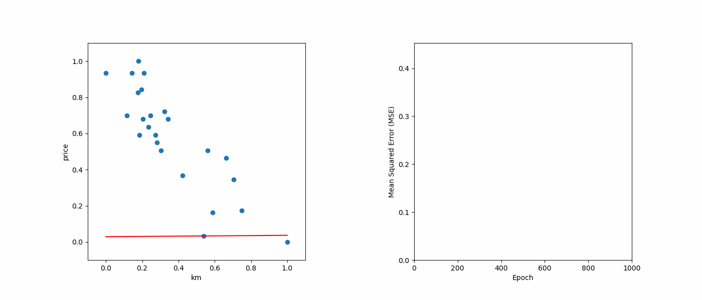

# ft_linear_regression
A python project that implements linear regression with gradient descent from scratch

## Introduction
The project is based on a [42](https://42berlin.de/) subject from the advanced curriculum. The goal is to make a linear regression model based on the gradient descent method that tries to predict the price of a car based on its mileage. It includes two parts: `train.py` and `predict.py`.  
1. `train.py` reads into `data/data.csv` and trains the linear regression model. When the training has been completed, the program writes the calculated coefficients in `model.json`.
2. `predict.py` accepts an integer as argument ( the mileage of a car ), reads `model.json` and uses the coefficients to predict the price for that car. 

## Features
The `train.py` program creates an animation with Matplotlib to show how the model "learns" over the iterations. The output is shown below:

## More
The full description can be found [here](README.ipynb). Since Github Markdown does not support LaTeX, but Jupyter Notebook does, the full description needed to be in another format.
